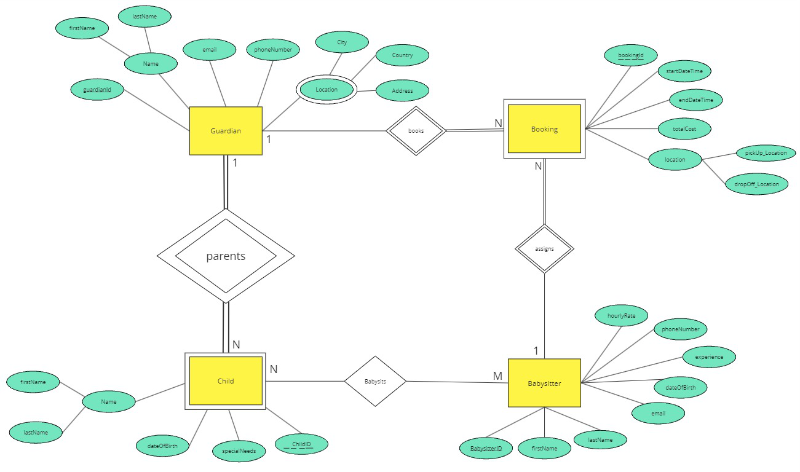
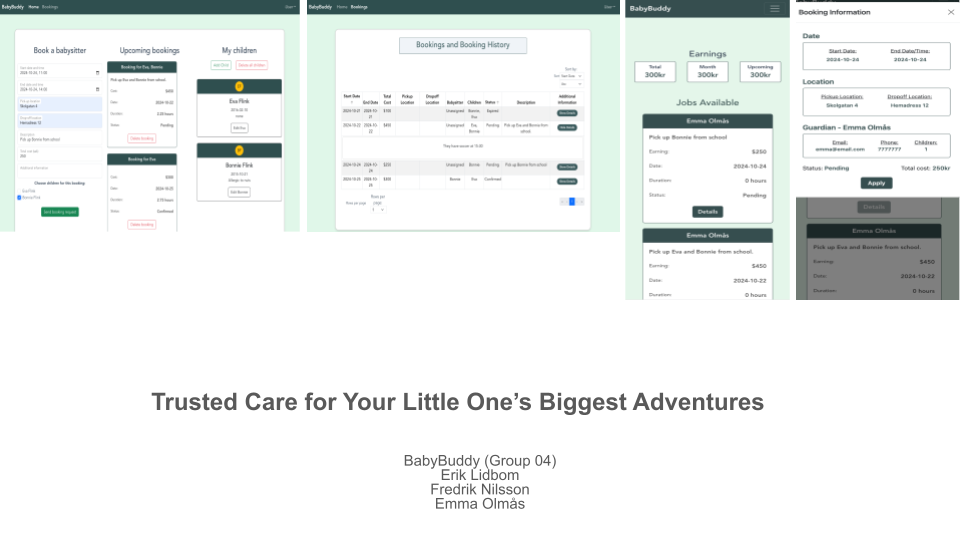

### Purpose

Finding a babysitter can be a time-consuming struggle for parents. BabyBuddy is a web application that connects parents with qualified babysitters in their local area and helps them book a babysitter with just a few clicks. Additionally, BabyBuddy makes it simple for babysitters to find local jobs, giving them a great opportunity to earn some extra income by providing their services. 

### Pages

* Login page: Sign up or login as either a guardian or babysitter.
* Babysitter homepage: View/search for families nearby that is in need for a babysitter. Change availability (time and date). Update personal information.
* Guardian homepage: View/search for available babysitters nearby. Change the request for babysitters. Update personal  information. Go to child page.
* Child: Add child. Remove child. Update personal information about children.
* Babysitter bookings: View scheduled bookings. Change bookings (location etc).
* Guardian bookings: View scheduled bookings. Change bookings (location etc).

1. **General Page**
* Home Page
* Sign Up / Login Page
* Contact Us Page
* FAQ Page
* Terms of Service/Policy Page
2. **Guardian Page**
* Dashboard/Home
* Manage Children Page
* Book a Babysitter Page
* Booking History Page
3. **Babysitter Pages**
* Dashboard/Home
* Manage Availability Page
* Booking Requests Page
* Booking History Page
* Earnings Page
4. **Admin Pages**
* Dashboard/Home
* User Management Page

### Entity-Relationship (ER) Diagram

## Teaser (MS3)

